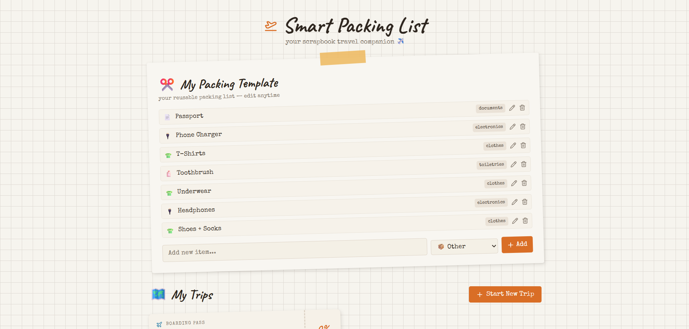

# ✈️ Smart Packing List

Smart Packing List is a simple web app that helps users prepare for trips by creating a reusable packing checklist. Users can create a packing template once and duplicate it for new trips, making it easy to stay organized.



##  Features
- Create a **reusable packing list template**
- Start a **new trip using the template**
- Check off items while packing
- View and manage multiple trips
- Data saved using **localStorage**

##  Built With
- React
- Vite
- Tailwind CSS
- LocalStorage

##  Run the Project

```bash
npm install
npm run dev
```
OR visit the project live at [link]

